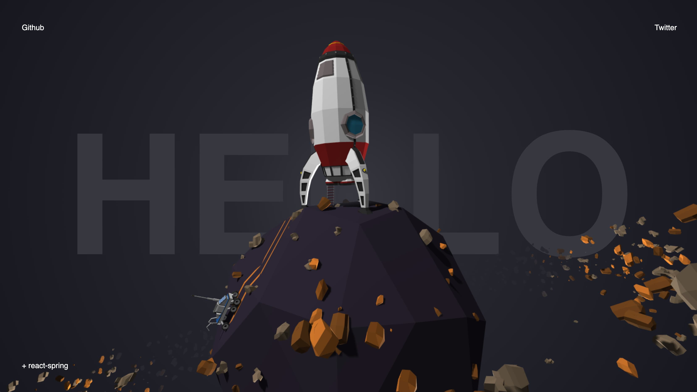

Live version: https://learnwithjason.surge.sh (wait a little for the assets to load)

    git clone https://github.com/drcmda/learnwithjason
    cd learnwithjason
    yarn
    yarn start

# What's this?

This is a demo Jason Lengstorf ([@jlengstorf](https://twitter.com/jlengstorf)) and I ([@0xca0a](https://twitter.com/0xca0a)) were building together in a [learn-with-jason episode on Twitch](https://www.twitch.tv/videos/477199412). We go into threejs a little, how to install three-fiber, what it is, how to create a simple scene, interaction, animation, game-loop fundamentals, lights, shadows, fog and how to load models.

# Links

learn-with-jason: https://www.youtube.com/watch?v=1rP3nNY2hTo

threejs: https://threejs.org

react-three-fiber: https://github.com/react-spring/react-three-fiber

threejs fundamentals: https://threejsfundamentals.org

sketchfab: http://sketchfab.com

blender: https://www.blender.org

blender 2.8 intro: https://www.youtube.com/watch?v=jBqYTgaFDxU

# Attributions

3d asset by Andrey Lukashov ([@overlaps](https://twitter.com/overlaps))/sketchfab: https://sketchfab.com/3d-models/space-exploration-wlp-series-8-91964c1ce1a34c3985b6257441efa500 GLTF data was compressed to draco via [gltf-pipeline](https://github.com/AnalyticalGraphicsInc/gltf-pipeline).
